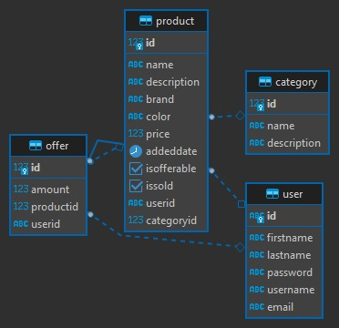
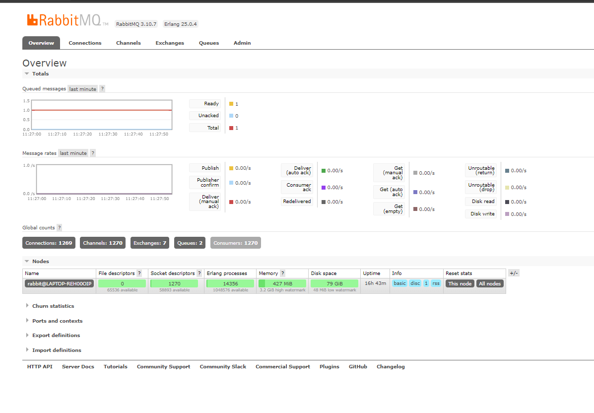
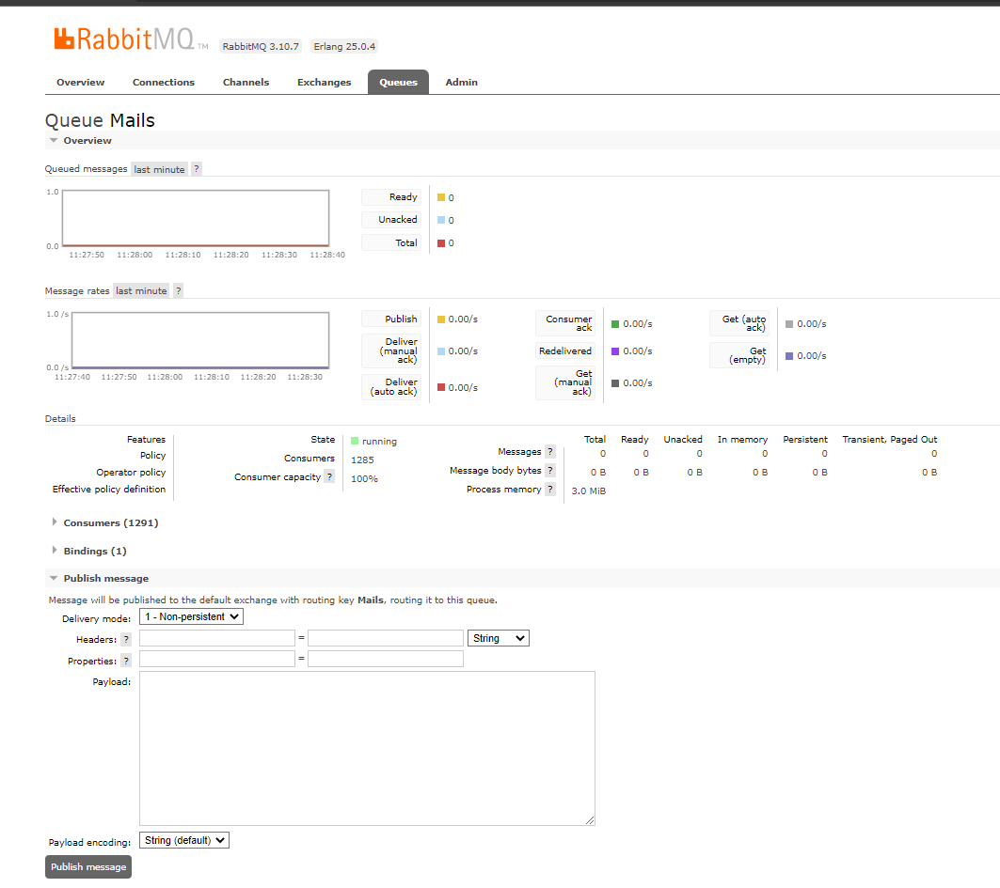
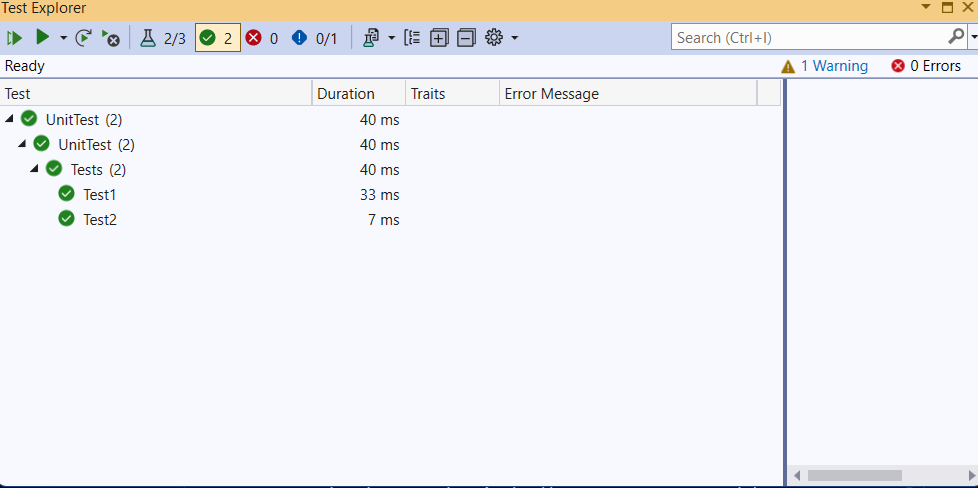

# Paycore-.Net-Bootcamp-Bitirme-Projesi

> The purpose of this project is to manage products of user like offering and selling.

## Information

| Entities  |  Columns |
|----------|------:|
| User |  id,firstname,lastname,password,username,email
| Offer |   id,amount,productid,userid 
| Product | id,name,description ,brand,color,price,addeddate,isofferable,issold,userid,categoryid
| Category | id,name,description

## ER

## Installation

Depending on the platform you are using, you can download its file from the clone section.

## What I have used so far:
 - Asp.Net Core Web API and ConsoleApp with .Net6.0 framework.
- Nhibernate as an ORM and Tools packages.
- PostgreSQL as an Database and packages.
- FluentValidation for validating user inputs.
- JWT Bearer Authentication library to generate tokens.
- Identity Framework for users.
- RabbitMQ server and packages.
- NLog for logging the exceptions.
- AutoMapper for mapping results.
- nUnit for Unit testing and Integration testings.
- Swagger used for tests.

## Usage

To use the program, first you need to change the configurations up to you.(like database settings).You can then log into the program. But first, you must the create account. When you log in to the program, you need to authoritize with token response.

Users can have products. You can create with CreteProduct endpoint. But first you need to create category of product. Then you can give a id of category to product's category.

User also can get all categories and add or update the category.

Different users can offer the product that own someone else. Also users can directly buy the product without offering. User can see the offers of products. And can accept or decline the offer. When user accept the offer , then product now belongs to another user that offer.

The system has a email service using RabbitMq to make this asyncroneusly without waiting. The purpose of email service is to send message when important things happen like user logged in, created acccount or something else.
But you need to set configuration of smpt settings.

All test are passed.

Good Luck :)
